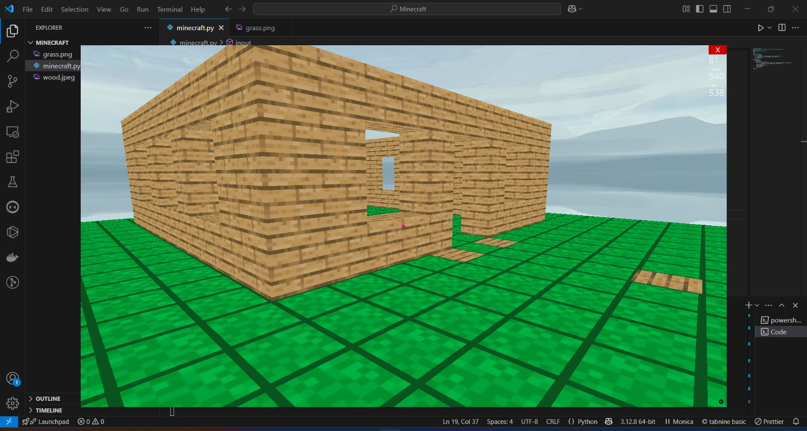

# Minecraft Clone in Python

Welcome to my Minecraft clone project built with the **Ursina** library! 

## 🏗️ About the Project

This project replicates the basic mechanics of Minecraft, including:

- Block placement and removal
- A simple 3D world with voxel-based terrain
- Smooth camera controls for exploration

I implemented this project using Python and the Ursina library to understand 3D graphics, game loops, and interactive worlds.

## 📸 Screenshot

Here’s a quick look at the game in action:

